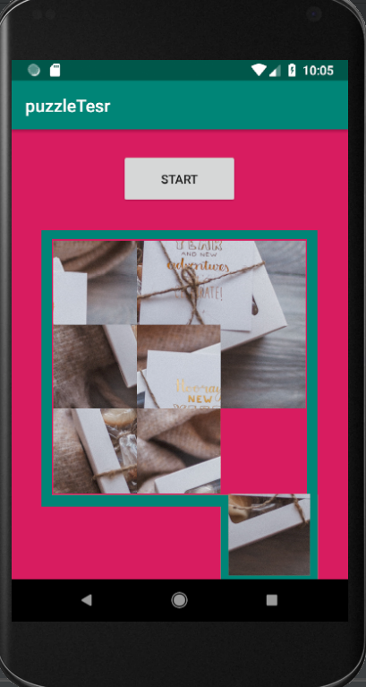

# slidePuzzle
 
I am very excited to present you this project. This was my First year project where i made a app in androidstudio. This was the time after the first semester during the winter vacation that i started exploring this field. This was also the time when i only knew about basic coding and very basic data structures. I welcome you to explore it. 

This is a very simple app of a game where you are given a puzzle to solve. This was one of my favourite games as a child. It got a very intresting algorithm that works in the background. Do check that out.

